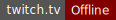
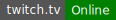

# Twitch status badge

[](https://twitch.tv/sorencodes)

This little app returns an SVG indicating a streamer's status on Twitch.

It's hosted in Google Cloud Run at https://twitch-status.soren.tools/

Simply add your username to the end of the url and it'll return either  or  as appropriate.

To add at to your README here on Github, you can do something like (all on one line):

```
[](https://twitch.tv/sorencodes)
```

That's an [image with an alt text](https://docs.github.com/en/get-started/writing-on-github/getting-started-with-writing-and-formatting-on-github/basic-writing-and-formatting-syntax#images) that is used as the [link "text" for the link to Twitch](https://docs.github.com/en/get-started/writing-on-github/getting-started-with-writing-and-formatting-on-github/basic-writing-and-formatting-syntax#links).
